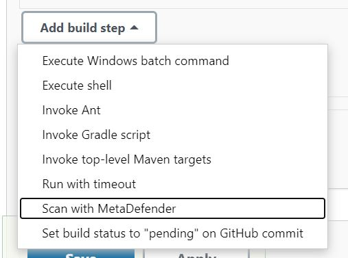
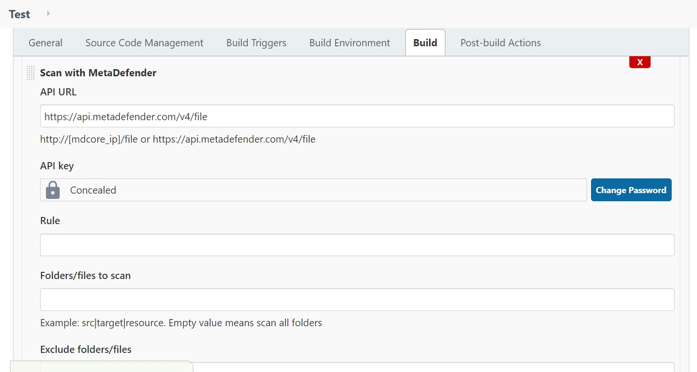
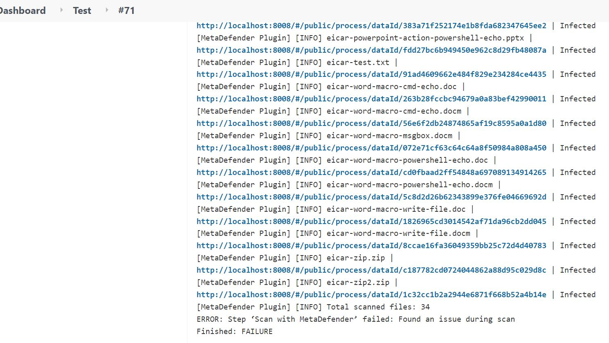

# Overview

Protect your reputation by checking your Jenkins builds for malware, secret before releasing to the public. With the MetaDefender plugin you can quickly scan your source code, artifacts with [MetaDefender](https://www.opswat.com/products/metadefender) which includes 30+ leading AV engines, Proactive DLP engine. 

# Build
```sh
mvn package
```

# Usage

- Sign up an account at <https://portal.opswat.com> and retrieve an API key for free user. The free user has limitations, please see the details at: <https://metadefender.opswat.com/licensing>. You can upgrade the license or purchase an on-premise product for freely usage
- Add "Scan with MetaDefender" build step or a post-build action or pipeline to your build configuration


- Fill in the configurations (see the below list)
- You can start testing by setting up Jenkins to pull the source code from a GitHub repo that has eicar test files such as https://github.com/fire1ce/eicar-standard-antivirus-test-files
- Trigger the build
- When the build is done, check the Console Output, it should show the scan results

- For pipeline, you can use this sample to generate an Eicar file and scan, the build should be failed at "scan" stage because of a threat found. Note: the script uses a static function, hudson.util.Secret.fromString, to convert string to secret so either you have to approve the function or uncheck Use Groovy Sandbox
```sh
pipeline {
    agent any
    stages {
        stage('build') {
            steps {
                bat 'echo X5O!P%%@AP[4\\PZX54(P^^)7CC)7}$EICAR-STANDARD-ANTIVIRUS-TEST-FILE!$H+H* > file_to_scan.txt'
            }
        }
        stage('scan') {
            steps {
                script {
                    withCredentials([string(credentialsId: 'MD_APIKEY', variable: 'md_apikey')]){
							step([$class: 'ScanBuilder', scanURL: 'https://api.metadefender.com/v4/file', apiKey: hudson.util.Secret.fromString(md_apikey), rule: '', 
							 source: '', exclude: '', timeout: 600, isPrivateScan: false, isShowBlockedOnly: false, 
							 isAbortBuild: true])             
					}
				}
			}
		}		
    }
}
```


Configuration:
- API URL: MetaDefender Core or MetaDefender Cloud scan URL
- ApiKey: api key
- Rule: define which rules you want to scan with MetaDefender
- Private scan: applicable for paid users on MetaDefender Cloud only
- Folders/files to scan: folders or files to scan, you can define multiple items, separated by "|", e.g.: src|resources
- Exclude folder/files from scan: folders or files to exclude from "source", you can define multiple items, separated by "|", e.g.: .git|.idea
- Scan timeout per file (s): a scan timeout for each file
- Mark the build as failure if a threat is found: the build will be marked as Failed if any issues found

